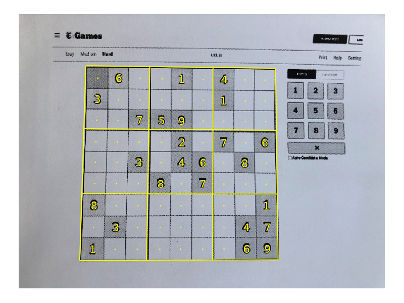
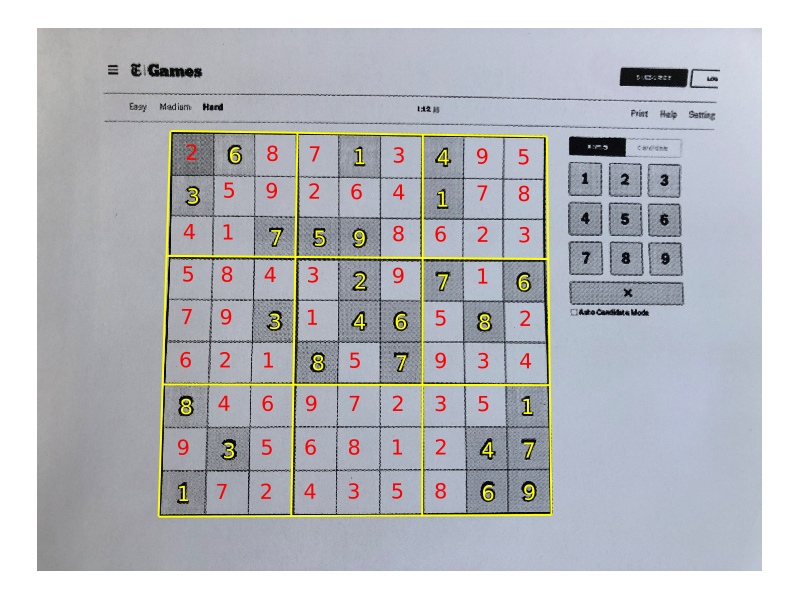

# SudokuReader.jl
## Overview

This reads in an image of a Sudoku puzzle,
extracts the numbers and place them in a projects them back on to the original image:
<figure>
  
</figure>

After this, the user can solve them the puzzle and project the solved numbers 
back on to the image. 
This repository does not include solver code. A solver I wrote in Julia can be found at 
[github.com/LiorSinai/SudokuSolver.jl](https://github.com/LiorSinai/SudokuSolver.jl).
<figure>
  
</figure>

### Example

First train the model:
1. Download data from the [Chars74k dataset](http://www.ee.surrey.ac.uk/CVSSP/demos/chars74k/). We only need `EnglishFnt.tgz` and sudirectories of Sample000-Sample010. 
3. `cd DigitDetection`
2. `julia --threads auto convert_to_mnist.jl`. 
3. `julia --threads auto train_recogniser.jl`. This will create LeNet5_e20.bson.

Then to use the program, either run [SudokuReader.ipynb](SudokuReader.ipynb) or code the following:
```Julia
image = "images/nytimes_20210807.jpg";
image = load(image_path)
# 1 grid
blackwhite, quad = detect_grid(
    image; 
    max_size=1024, 
    blur_window_size=5, σ=1.1, 
    threshold_window_size=15, threshold_percentage=7
    );
# 2 straighten
warped, invM = four_point_transform(blackwhite, quad)
# 3 Digit detection
BSON.@load "DigitDetection\\outputs\\LeNet5\\LeNet5_e20.bson" model
grid, centres, probs = read_digits(
    warped, model, 
    offset_ratio=0.1, radius_ratio=0.25, detection_threshold=0.1
    );
```

Each of the 3 outputs are 9×9 matrices. They can be used to generate an output image as follows:
```Julia
threshold = 0.9
image_out = imresize(image, size(blackwhite));
canvas = plot(image_out, ticks=nothing, border=:none, size=(800, 600));

centres_aligned = align_centres(centres, grid_orig .> 0)
for i in 1:9
    for j in 1:9
        centre = centres_aligned[i, j]
        centre_unwarped = perspective_transform(invM)(centre)
        label =  (probs[i, j] > threshold) ? string(grid[i, j]) : "·"
        annotate!(canvas, centre_unwarped[2], centre_unwarped[1], label, :yellow)
    end
end
canvas
```

## Algorithm

The algorithm uses classic image processing techniques for grid and digit extraction.
This is mostly done with Images.jl and related modules as well as custom code.

1. Grid detection.
    1. Preprocessing.
        1. Resize the image (speeds up all other operations).
        2. Blur → removes noise.
        3. Convert to black and white by applying an adaptive threshold.
    2. Find external contours.
    3. Assume largest contour is the grid. Fit a quadrilateral to the largest contour.
2. Straighten.
    1. Solve linear system for a homography matrix of a four point transform from a quadrilateral to a rectangle.
    2. Warp image according to the homography matrix.
3. Digit detection.
    1. Divide the rectangle into a grid of 9×9 blocks.
    2. For each block:
        1. Detect if an object is in the centre.
        2. If there is, get all the connected components. Extract the first large component in the centre.
        3. Make a prediction using a deep learning Neural Network (LeNet5).
4. Project numbers on to grid.

The algorithm works well on well selected images. However it is not robust and the false positivity rate is high.

## Notebooks

I have provided development notebooks in the [notebooks](notebooks) folder.
These are useful for getting around Julia's slow start up times for debugging.

## Dependencies

This repository uses the following packages:
- Images.jl
- ImageFiltering.jl
- ImageBinarization.jl
- ImageTransformations.jl
- CoordinateTransformations.jl
- StaticArrays.jl
- Flux.jl >= 0.13.9
- BSON.jl
- Plots.jl
- Test.jl

---

By Lior Sinai