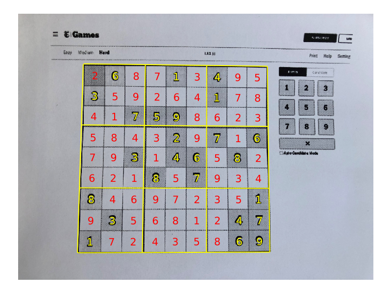

# SudokuReader.jl

By Lior Sinai

This is a Julia program that can read in an image of a Suduko puzzle,
extract the numbers and place them in a corresponding grid.
These numbers can be projected back on to the original image:
<figure>
  
</figure>

After this, the user can solve them the puzzle and projected the solved numbers 
back on to the image. 
This repository does not include solver code. A solver I wrote in Julia can be found at 
[github.com/LiorSinai/SudokuSolver.jl](https://github.com/LiorSinai/SudokuSolver.jl).
<figure>
  
</figure>


### Example

First train the model:
1. Download data from the [Chars74k dataset](http://www.ee.surrey.ac.uk/CVSSP/demos/chars74k/). We only need `EnglishFnt.tgz` and sudirectories of Sample000-Sample010. 
2. Run the `convert_to_mnist.jl` script. 
3. Run the `train_recogniser.jl` script.

Then to use the program:
```
image = "images/nytimes_20210807.jpg";
image = load(image_path)
# 1 grid
blackwhite, par = detect_grid(image, max_size=1024, blur_window_size=5, σ=1, threshold_window_size=25);
# 2 straighten
warped, invM = fourPointTransform(blackwhite, par)
# 3 Digit detection
BSON.@load "DigitDetection\\models\\LeNet5_e20.bson" model
grid, centres, probs = read_digits(warped, model, offset_ratio=0.1, radius_ratio=0.25, detection_threshold=0.02)
```

Each of the 3 outputs are 9×9 matrices. They can be used to generate an output image as follows:
```
threshold = 0.9
image_out = imresize(image, size(blackwhite));
canvas = plot(image_out, ticks=nothing, border=:none, size=(800, 600));

for i in 1:9
    for j in 1:9
        centre = centres[i, j]
        centre_unwarped = apply_homography(centre, invM)
        label =  (probs[i, j] > threshold) ? string(grid[i, j]) : "·"
        annotate!(canvas, centre_unwarped[2], centre_unwarped[1], label, :yellow)
    end
end
canvas

```


## Algorithm

The algorithm uses classic image processing techniques for grid and digit extraction.
This is mostly done with Images.jl and related modules as well as custom code.

1. Grid detection.
    1. Preprocessing.
        1. Resize the image (speeds up all other operations).
        2. Blur → removes noise.
        3. COnverting to black and white by applying an adaptive threshold.
    2. Find external contours.
    3. Assume largest contour is the grid. Fit a parallelogram to the largest contour.
2. Straighten.
    1. Solve linear system for a homography matrix of a four point transform from a parallelogram to a rectangle.
    2. Warp image according to the homography matrix.
3. Digit detection.
    1. Divided the rectangle into a grid of 9×9 blocks.
    2. For each block:
        1. Detect if an object is in the centre.
        2. If there is, get all the connected components. Extract the first large component in the centre.
        3. Make a prediction using a deep learning Neural Network (LeNet5).
4. Project numbers on to grid.

The algorithm works well on well selected images. However it is not robust and the false positivity rate is high.


# Dependencies

This repository uses the following packages:
- Images.jl
- ImageFiltering.jl
- ImageBinarization.jl
- ImageTransformations.jl
- CoordinateTransformations.jl
- StaticArrays.jl
- Flux.jl
- BSON.jl
- Plots.jl
- FileIO.jl
- Test.jl
